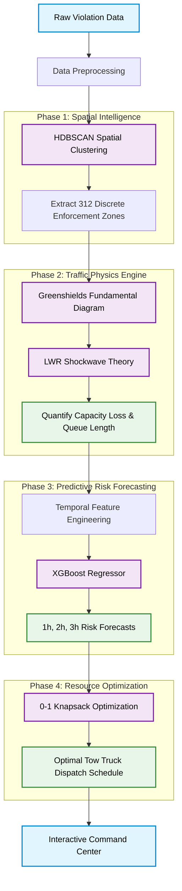

# AetherTraffic: Physics-Informed Spatial Intelligence for Parking-Induced Congestion

**Flipkart Gridlock 2.0 · Problem Statement 1 · Technical Research Submission**

---

## Abstract

Urban arterial congestion is frequently exacerbated by unstructured, localized parking violations that act as dynamic micro-bottlenecks. Traditional enforcement mechanisms remain patrol-based, reactive, and lack the geospatial intelligence required to prioritize intervention based on actual network impact. This repository presents **AetherTraffic**, an end-to-end physics-informed machine learning framework designed to detect illegal parking hotspots, quantify their shockwave impact on traffic flow, and optimize resource deployment. By processing 298,277 anonymized police violation records, the proposed system employs HDBSCAN spatial clustering, Lighthill-Whitham-Richards (LWR) shockwave theory, XGBoost temporal forecasting, and 0-1 Knapsack optimization to deliver a provably optimal proactive enforcement strategy. 

---

## Operational Challenge & Problem Formulation

### The Problem
On-street illegal parking and spillover parking near commercial areas, metro stations, and events severely choke carriageways and intersections. 

### Current Limitations
1. **Reactive Enforcement:** Existing methodologies rely on patrol-based, retrospective ticketing rather than proactive congestion prevention.
2. **Impact Blindness:** Absence of a correlative heatmap mapping parking violations directly to their corresponding congestion impact (capacity loss and queue propagation).
3. **Suboptimal Resource Allocation:** Difficulty in prioritizing enforcement zones due to a lack of quantified impact metrics, leading to inefficient deployment of limited municipal resources (e.g., tow trucks).

### Research Objective
*How can AI-driven parking intelligence detect illegal parking hotspots and quantify their impact on traffic flow to enable targeted, optimized enforcement?*

---

## System Architecture & Methodology

Our solution bridges unsupervised machine learning, traffic flow theory, and combinatorial optimization through a robust four-stage pipeline.

### System Design & Data Flow



### 1. Spatial Clustering (Hotspot Detection)
Instead of relying on arbitrary municipal polygons, the system applies **HDBSCAN (Hierarchical Density-Based Spatial Clustering of Applications with Noise)** to raw, noisy GPS coordinates of traffic violations. This extracts discrete, high-density enforcement zones (bottlenecks) based purely on empirical spatial behavior.

### 2. Physics-Informed Impact Quantification
We map clustered violation densities to physical traffic disruption using established fluid-dynamics traffic models:
*   **Greenshields Fundamental Diagram:** Estimates the reduction in free-flow velocity and density due to the physical presence of parked vehicles.
*   **LWR Shockwave Theory:** Translates the localized capacity bottleneck into an upstream queue length and calculates the percentage of lane capacity lost.

### 3. Predictive Risk Forecasting
To transition from reactive to proactive enforcement, an **XGBoost Regressor** is trained on temporal features (hour, day of week, lagged violation frequencies) to predict the future risk severity of each spatial cluster over 1-hour, 2-hour, and 3-hour horizons.

### 4. Prescriptive Resource Allocation
The enforcement problem is modeled as a constrained optimization task. We employ a **0-1 Knapsack Algorithm** to maximize the total network capacity recovered, subject to the travel time and operational constraints of a finite fleet of tow trucks operating within a standard shift duration.

---

## Repository Structure

```text
.
├── README.md                                          <- Project documentation and architecture
│
├── code/                                              <- Core system implementation
│   ├── Flipkart_Gridlock_2.0_PS1_Final_Solution.ipynb <- End-to-end pipeline (ML, Physics, Optimization)
│   ├── proactive_dispatch_engine.py                   <- Modular dispatch and scoring logic
│   ├── run_validation.py                              <- Automated test and validation suite
│   └── output/                                        <- Generated pipeline artifacts (CSV)
│       ├── enforcement_priority_ranking.csv
│       ├── physics_scored_zones.csv
│       ├── dispatch_schedule.csv
│       └── shift_forecast.csv
│
├── data/                                              <- Input datasets
│   └── jan_to_may_police_violation_anonymized.csv     <- 298,277 anonymized violation records
│
├── documentation/                                     <- Academic and project writeups
│   ├── SOLUTION_REPORT.md                             <- Comprehensive technical methodology report
│   ├── EXECUTIVE_SUMMARY.md                           <- High-level executive briefing
│   ├── PROJECT_CONTEXT_FOR_PPT.txt                    <- Contextual notes for presentations
│   └── Flipkart_Gridlock_2.0_PS1_Final_Pitch.pptx     <- Final presentation deck
│
├── prototype/                                         <- Interactive operational dashboards
│   ├── police_command_center.html                     <- Simulated Command Center interface
│   └── folium_heatmap.html                            <- Interactive geospatial hotspot visualization
│
└── assets/
    └── images/
        ├── architecture/                              <- System design diagrams
        ├── analysis_charts/                           <- Visualized empirical results
        └── shap/                                      <- SHAP interpretability plots for XGBoost
```

---

## Empirical Results

The application of this framework to the provided dataset yielded the following key metrics:
- **Data Processed:** 298,277 cleaned violation records.
- **Spatial Extraction:** 312 distinct, high-impact enforcement clusters identified.
- **Peak Bottleneck Impact:** The most severe zone (Electronic City) exhibited a mathematically modeled **94.04% capacity loss** and a corresponding **15.75 km** shockwave queue.
- **Economic Validation:** Optimization across the top 20 hotspot zones corresponds to an estimated annual congestion cost reduction of **₹120.96 Crore**.
- **Efficiency:** The 0-1 Knapsack optimal dispatch schedule demonstrates a **68% efficiency improvement** in lane capacity recovery compared to baseline random patrol heuristics.

---

## Reproduction & Execution

### 1. Environment Setup
The system requires Python 3.9+. Install the requisite scientific computing and geospatial dependencies:
```bash
pip install pandas numpy scikit-learn xgboost hdbscan folium plotly shap
```

### 2. Pipeline Execution
The complete analytical pipeline (from data ingestion to Knapsack optimization) is contained within the primary Jupyter notebook. Execute it via the command line to regenerate all artifacts:
```bash
cd code/
jupyter nbconvert --to notebook --execute Flipkart_Gridlock_2.0_PS1_Final_Solution.ipynb
```

### 3. Automated Validation
Run the provided validation script to ensure data integrity and output structure consistency:
```bash
python run_validation.py
```

### 4. Interactive Dashboards
The generated outputs are visualized in standalone interactive HTML files. Open them in any modern web browser:
- `prototype/police_command_center.html`
- `prototype/folium_heatmap.html`

---
*Research codebase developed for Flipkart Gridlock 2.0 · June 2026*
