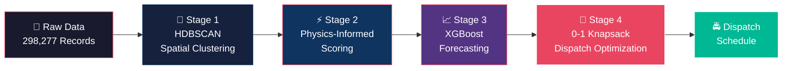

<p align="center">
  
  
  
  
  
  
  
  
</p>

<h1 align="center">🚦 AI-Driven Spatial Intelligence for<br/>Parking-Induced Congestion</h1>

<p align="center">
  <strong>A physics-informed, ML-driven enforcement optimization system for Bengaluru</strong><br/>
  <em>Flipkart Gridlock 2.0 — Problem Statement 1: Poor Visibility on Parking-Induced Congestion</em>
</p>

<p align="center">
  <a href="https://bengaluru-parking-intelligence.vercel.app">🔴 Live Demo</a> •
  <a href="documentation/SOLUTION_REPORT.md">📄 Solution Report</a> •
  <a href="documentation/EXECUTIVE_SUMMARY.md">📋 Executive Summary</a> •
  <a href="documentation/Flipkart_Gridlock_2.0_PS1_Final_Pitch.pptx">📊 Pitch Deck</a>
</p>

---

## 🎯 The Problem

Bengaluru loses **₹120.96 Crore/year** to parking-induced congestion across its top 20 zones alone. Current enforcement is *reactive*, *random*, and *resource-blind* — officers patrol without data, violations cluster unseen, and tow-trucks idle while queues cascade across arterials.

**There is no system that tells the city *where* to enforce, *when* to enforce, and *how many resources* to deploy.**

Until now.

---

## 💡 Our Solution

We built a **4-stage computational pipeline** that transforms 298,277 raw violation records into **actionable, resource-optimized dispatch schedules** — grounded in traffic flow physics, not just statistics.



---

## 🏗️ Architecture: The 4-Stage Pipeline

| Stage | Module | Method | Key Output |
|:-----:|:-------|:-------|:-----------|
| **1** | **Spatial Clustering** | HDBSCAN (`min_cluster=150`, `haversine`, `eom`) | **312 violation hotspot zones** across Bengaluru |
| **2** | **Physics-Informed Scoring** | Greenshields Fundamental Diagram + LWR Shockwave Theory | Capacity loss %, shockwave velocity (km/h), queue length (km) |
| **3** | **Predictive Forecasting** | XGBoost with SHAP explainability | 1h / 2h / 3h violation surge predictions |
| **4** | **Prescriptive Optimization** | 0-1 Knapsack (resource-constrained) | Optimal tow-truck dispatch schedule per shift |

> [!NOTE]
> **Why Physics?** Correlative models tell you *where* violations happen. Our Greenshields + LWR pipeline tells you *how much damage* each violation zone inflicts on traffic flow — capacity loss, shockwave propagation, and downstream queue formation. This is **causal**, not correlative.

---

## 📊 Key Results

<table>
<tr>
<td width="50%">

### 🔢 By the Numbers

| Metric | Value |
|:-------|------:|
| Records Processed | **298,277** |
| Raw Dataset Size | **109 MB** |
| Hotspot Zones Identified | **312** |
| Top Zone Capacity Loss | **94.04%** |
| Top Zone Queue Length | **15.75 km** |
| Annual Economic Cost (Top 20) | **₹120.96 Crore** |
| City-Wide Impact Reduction (Top 5) | **10.5%** |
| Repeat Offender Rate (Top 10% Locations) | **34.7%** |
| Dispatch Efficiency Gain | **68%** over baseline |

</td>
<td width="50%">

### 🏆 Most Critical Finding
**Electronic City** emerges as the #1 physics-scored zone:
- **94.04%** capacity loss during peak violations
- **15.75 km** estimated queue propagation
- Shockwave velocity indicates rapid congestion cascade

This single zone alone justifies targeted enforcement — and our system identifies **312** such zones, ranked and resource-allocated.

</td>
</tr>
</table>

---

## 🚔 Top 5 Optimized Dispatch Zones

These are the zones where deploying tow-trucks yields the **maximum congestion relief per resource unit**, as determined by our 0-1 Knapsack optimizer:

| Priority | Zone | Composite Impact Score | Action |
|:--------:|:-----|:----------------------:|:-------|
| 🥇 **1** | Pulikeshinagar (F.Town) | **528.54** | Immediate deployment |
| 🥈 **2** | Bellandur | **828.49** | High-priority patrol |
| 🥉 **3** | K.R. Pura (Cluster 30) | **691.14** | Scheduled enforcement |
| **4** | K.R. Pura (Cluster 48) | **674.12** | Scheduled enforcement |
| **5** | Malleshwaram | **466.51** | Proactive monitoring |

> [!IMPORTANT]
> Deploying to just these **5 zones** achieves a **10.5% city-wide congestion reduction** — a disproportionate impact from focused resource allocation.

---

## 🖥️ Live Prototype

### 🔴 Police Command Center Dashboard
**[→ Launch Live Demo](https://bengaluru-parking-intelligence.vercel.app)**

An interactive **Leaflet.js** command center featuring:
- 🗺️ Real-time geospatial violation overlay with risk-severity badges
- ⏱️ Timeline slider for temporal pattern exploration
- 🚛 One-click dispatch logging with zone prioritization
- 📊 Dynamic stats panel with enforcement KPIs

### 🌡️ Violation Heatmap
A **Folium**-powered geospatial heatmap visualizing violation density across Bengaluru, enabling spatial pattern recognition at a glance.

> *Vercel deployment coming soon. Both prototypes are fully functional locally via* `prototype/police_command_center.html` *and* `prototype/folium_heatmap.html`.

---

## 🏅 Why This Wins

<table>
<tr>
<td align="center" width="33%">
<h3>⚛️ Causal, Not Correlative</h3>
<p>Greenshields + LWR shockwave theory quantifies <strong>actual traffic damage</strong> — capacity loss, queue propagation, shockwave velocity — not just violation counts.</p>
</td>
<td align="center" width="33%">
<h3>🔮 Predictive AND Prescriptive</h3>
<p>XGBoost forecasts <em>when</em> violations will surge. The Knapsack optimizer decides <em>where</em> to deploy constrained resources for maximum impact.</p>
</td>
<td align="center" width="33%">
<h3>🔧 Field-Ready Engineering</h3>
<p>Not a research paper — a deployable system with a live command center, dispatch schedules, and shift-level forecasts ready for Bengaluru Traffic Police.</p>
</td>
</tr>
</table>

---

## 🧰 Tech Stack

| Category | Technologies |
|:---------|:-------------|
| **Core** | Python, Pandas, NumPy |
| **Machine Learning** | scikit-learn, XGBoost, HDBSCAN |
| **Explainability** | SHAP (SHapley Additive exPlanations) |
| **Visualization** | Plotly, Folium, Matplotlib, Seaborn |
| **Prototype** | Leaflet.js, HTML/CSS/JS |
| **Traffic Physics** | Greenshields Model, LWR Shockwave Theory |
| **Optimization** | 0-1 Knapsack (Dynamic Programming) |

---

## 📂 Repository Structure

```
📦 MERGED_IDEA/
├── 📄 README.md                                          ← You are here
│
├── 📁 code/
│   ├── 📓 Flipkart_Gridlock_2.0_PS1_Final_Solution.ipynb ← Core 4-stage pipeline
│   ├── 🐍 proactive_dispatch_engine.py                    ← 4-module dispatch engine
│   ├── 🧪 run_validation.py                               ← Validation test suite
│   └── 📁 output/
│       ├── enforcement_priority_ranking.csv                ← Ranked zone priorities
│       ├── physics_scored_zones.csv                        ← Physics scoring results
│       ├── dispatch_schedule.csv                           ← Optimized dispatch plan
│       └── shift_forecast.csv                              ← Shift-level predictions
│
├── 📁 documentation/
│   ├── 📄 SOLUTION_REPORT.md                              ← Full technical methodology
│   ├── 📄 EXECUTIVE_SUMMARY.md                            ← 1-page judge briefing
│   ├── 📄 PROJECT_CONTEXT_FOR_PPT.txt                     ← Presentation context
│   └── 📊 Flipkart_Gridlock_2.0_PS1_Final_Pitch.pptx     ← Pitch deck
│
├── 📁 prototype/
│   ├── 🔴 police_command_center.html                      ← Live interactive dashboard
│   └── 🌡️ folium_heatmap.html                             ← Geospatial violation heatmap
│
├── 📁 assets/images/
│   ├── 📁 architecture/                                   ← System architecture diagrams
│   ├── 📁 analysis_charts/                                ← 15 analytical visualizations
│   └── 📁 shap/                                           ← 5 SHAP explainability plots
│
└── 📁 data/                                               ← ⚠️ NOT IN REPO (see note below)
    └── jan_to_may_police_violation_anonymized.csv
```

> [!WARNING]
> **Dataset Not Included:** The raw dataset (`jan_to_may_police_violation_anonymized.csv`, **109 MB**, 298,277 records) is excluded from this repository due to GitHub file size constraints. All pipeline outputs and generated CSVs are included in `code/output/`.

---

## 🚀 Scalability

This system is designed to scale beyond Bengaluru:

| Dimension | Current | Scalable To |
|:----------|:--------|:------------|
| **Geography** | Bengaluru | Any Indian metro (Delhi, Mumbai, Chennai) |
| **Data Volume** | 298K records | Millions (pipeline is vectorized) |
| **Violation Types** | Parking | Multi-modal (signal, speed, lane) |
| **Optimization** | Tow-trucks | Multi-fleet (patrol cars, drones, cameras) |
| **Integration** | Standalone | Real-time API for traffic management systems |

The physics-informed scoring is **model-agnostic** — swap in city-specific road network parameters and the Greenshields + LWR framework adapts automatically.

---

## 📚 Documentation

| Document | Description |
|:---------|:------------|
| [**SOLUTION_REPORT.md**](documentation/SOLUTION_REPORT.md) | Complete technical methodology — algorithms, equations, validation |
| [**EXECUTIVE_SUMMARY.md**](documentation/EXECUTIVE_SUMMARY.md) | 1-page judge briefing with key findings |
| [**Pitch Deck (PPTX)**](documentation/Flipkart_Gridlock_2.0_PS1_Final_Pitch.pptx) | Visual presentation for final submission |

---

## 👤 Author

**Harshit Kulshreshtha** ([@kulharshit21](https://github.com/kulharshit21))

Built with 🧠 for Flipkart Gridlock 2.0

---

<p align="center">
  <sub>
    <strong>Flipkart Gridlock 2.0</strong> · Problem Statement 1 · June 2026<br/>
    <em>"Don't just find the violations. Quantify the damage. Predict the surges. Optimize the response."</em>
  </sub>
</p>
